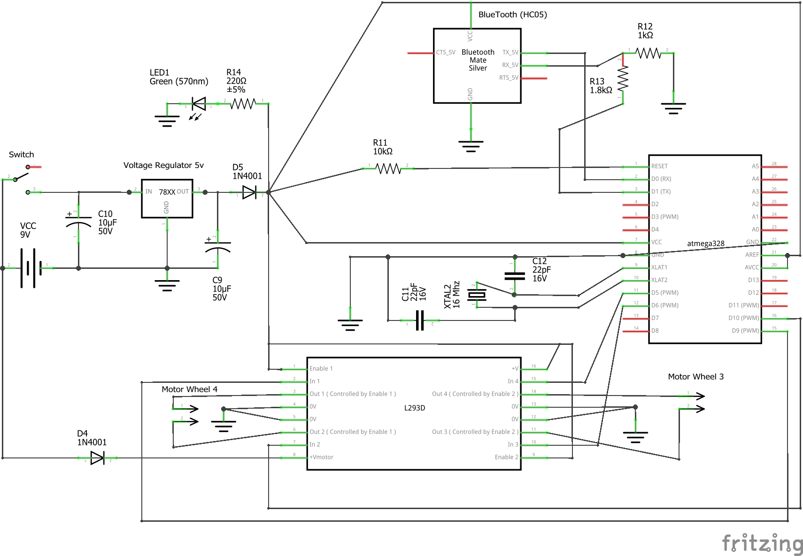

# Electronics

I have divided into 2 PCBs to make it simpler with perfboard but if you want to use just one there is an `all` schema for the entire circuit.

## Component List
* 1 x	Bluetooth Module HC-05 (or HC-06)
* 1 x	Atmega328
* 1 x	CI L293D
* 2 x	Electrolytic Capacitor 10μF voltage 9V+
* 2 x	Ceramic Capacitor	22pF voltage 5V+
* 2 x	Rectifier Diode	1N4001
* 1 x	LED 5mm
* 1 x	10kΩ Resistor
* 1 x	1kΩ Resistor
* 1 x	1.8kΩ Resistor
* 1 x	220Ω Resistor
* 1 x	Switch
* 1 x	Battery 9v and Female extension
* 1 x	Voltage Regulator	package to220; voltage 5V; LM7805
* 1 x	Crystal frequency 16 Mhz

Using one PCB: 
* 2 x	Generic male header - 2 pins (for connecting the DC motors)

Using Two PCB:
* 2 x	Generic male header - 2 pins (for Out and In 5v)
* 3 x	Generic male header - 4 pins (for DC Motors and signals from Arduino)

## Circuit schema

